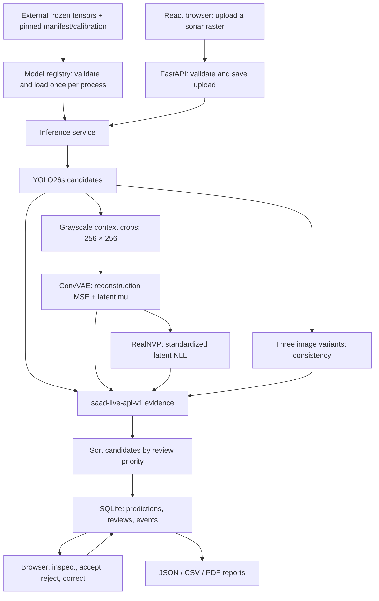

# SAAD — Seabed-Aware Anthropogenic Anomaly Detector

SAAD helps a human reviewer inspect possible anthropogenic objects and anomalies in side-scan sonar imagery. A frozen YOLO26s detector proposes candidates; ConvVAE reconstruction, RealNVP latent normality and test-time augmentation (TTA) supply supporting evidence. The application ranks candidates for review and saves scans, decisions, corrected boxes and reports locally.

**Current maturity: verified local-loopback research prototype.** The repository contains application code and numerical regression references, but no trained weights or sonar images. Scores express review priority, not object probabilities. Detection accuracy, external deployment and cross-hardware numerical parity are not established.

## Contents

- [System architecture](#system-architecture)
- [Implemented features](#implemented-features)
- [Models and evidence](#models-and-evidence)
- [Results and verification](#results-and-verification)
- [Installation and quick start](#installation-and-quick-start)
- [First scan and review](#first-scan-and-review)
- [Testing](#testing)
- [Repository and documentation map](#repository-and-documentation-map)
- [Research and provenance](#research-and-provenance)
- [Limitations, security and licensing](#limitations-security-and-licensing)
- [Acknowledgements and references](#acknowledgements-and-references)

## System architecture



Model initialization and asset validation are separate from request orchestration. The original `POST /api/analyze` response remains compatible. Model predictions remain separate from human review state; corrections do not change the stored detector box.

Read [Architecture](docs/ARCHITECTURE.md) for numerical details, [backend](backend/README.md) for modules and API contracts, and [web](web/README.md) for browser data flow.

## Implemented features

| Capability | Implemented boundary |
| --- | --- |
| Image upload | API accepts PNG, JPG/JPEG, BMP, TIF/TIFF and WebP filenames, then decodes the image with Pillow. Default limits: 25 MiB and 50 million pixels. The browser picker advertises PNG, JPEG, TIFF and WebP; it does not advertise BMP. |
| Candidate inspection | Percentage-coordinate boxes, raw model signals, normalized evidence, priority, uncertainty and recommendation. The observed detector class is class 0, anthropogenic; there is no verified multiclass debris taxonomy. |
| Human review | Accept, reject or correct a candidate box. Corrections are saved as bounded percentage coordinates. |
| Saved scans | SQLite history, direct scan navigation and refresh, pending review queue ordered by model priority. |
| Audit trail | Current decision plus an application-maintained append-only review-event history. No cryptographic tamper-evidence claim. |
| Reports | JSON combines prediction/review/event data; CSV exports candidate rows; text-only PDF summarizes evidence and boxes. |
| Error handling | Startup rejects missing/mismatched assets. Upload, schema and storage errors have explicit HTTP responses; saved scans identify partial inference. |

The Analytics route is a placeholder. Authentication, shared-user coordination and public deployment are future engineering work, not implemented release features.

## Models and evidence

| Component | Verified runtime behavior |
| --- | --- |
| YOLO26s | `imgsz=640`, confidence threshold `0.05`; candidates retain decoded class IDs and confidence. |
| Crop | Pillow grayscale; context of 20% of box width/height on each side; square crop shifted within image bounds, rounded coordinates, bilinear resize to 256×256; float32 / 255. |
| ConvVAE | Single-channel `[N,1,256,256]` input; five stride-2 encoder blocks ending at `512×8×8`; 128-dimensional encoder mean; deterministic mean-based reconstruction; mean squared error. |
| RealNVP | Eight affine coupling layers, hidden size 256, alternating masks over 128 latent values; scores the encoder mean standardized by frozen latent mean/std as negative log likelihood. |
| TTA | Brightness ×1.15, contrast ×0.85, Gaussian noise σ=5 with seed 42; same-class IoU/confidence agreement across three reruns. |
| Live evidence | Normal-reference P5/P95 clipping; YOLO/VAE/flow weights 0.50/0.20/0.30; priority and uncertainty incorporate corroboration and TTA. |

**Policy identity matters:** `saad-live-api-v1` is the only deployed default. Offline Evidence Engine v3 (`saad-offline-evidence-v3`) shares normalization values but uses different priority, uncertainty and action rules and no TTA. It remains archived research and is not a selectable production policy. Exact formulas and threshold ties are documented in [Architecture](docs/ARCHITECTURE.md).

## Results and verification

| Verification | Context and result |
| --- | --- |
| Original repeatability | Two direct GhostVision API calls on the audited GPU: 7 candidates, maximum measured numerical difference 0.0. |
| Frozen migration regression | Full local suite: 25/25 tests passed, no skips/failures, every printed golden maximum delta 0.0. API fixture: GhostVision 7 candidates. Detector-order stage fixtures: AI4Shipwrecks 14, GhostVision 7, SubPipeMini2 6. |
| Fresh installation | New isolated wheel environment on the audited Windows machine; dependency validation and full GPU suite passed. |
| Local integration | Real HTTP/browser uploads, persisted accept/reject/correct decisions, refresh/restart, history, pending queue and report downloads verified. |
| GitHub CI | 13 asset-independent backend tests, dependency validation, frontend types/lint/build and repository hygiene. No private assets or GPU inference. |

The audited stack is Python 3.11.0, Torch 2.11.0+cu128, torchvision 0.26.0+cu128 and an RTX 4070 Laptop GPU on Windows. [Evaluation](docs/EVALUATION.md) gives the fixture dimensions, tolerances, dates, negative findings and scope.

These are reproducibility and integration results. They are not precision, recall, mAP, AUROC or evidence of generalization. The three images are regression cases rather than a statistically valid test set; annotation gaps and temporal split overlap remain documented.

## Installation and quick start

Use **Python 3.11**, **Node 24 / npm 11**, and the audited CUDA 12.8 PyTorch wheels for local GPU parity. Supply authorized copies of all five frozen tensors in the layout pinned by [config/model_manifest.json](config/model_manifest.json). The live calibration is committed as [config/live_api_v1.json](config/live_api_v1.json) and hash-validated. No public checkpoint or dataset download is supplied.

From the repository root in PowerShell, create a new isolated environment:

```powershell
py -3.11 -m venv .venv
.\.venv\Scripts\python.exe -m pip install --extra-index-url https://download.pytorch.org/whl/cu128 -r backend\requirements-original-windows-cu128.lock.txt
.\.venv\Scripts\python.exe -m pip install reportlab==5.0.1
.\.venv\Scripts\python.exe -m pip check
Copy-Item .env.example .env
# Edit SAAD_ARTIFACT_DIR in .env to your authorized external asset root.
New-Item -ItemType Directory -Path var\ultralytics -Force | Out-Null
$env:YOLO_AUTOINSTALL='False'
$env:YOLO_CONFIG_DIR=(Resolve-Path var\ultralytics).Path
.\.venv\Scripts\python.exe -B -m uvicorn main:app --app-dir backend --host 127.0.0.1 --port 8000
```

In a second PowerShell session at the repository root:

```powershell
cd web
npm ci
npm run dev -- --host 127.0.0.1
```

Open the local Vite URL. The browser defaults to `http://127.0.0.1:8000`. The API cannot start without the validated frozen tensors. It does not require the three golden test images for ordinary operation.

The [Setup guide](docs/SETUP.md) includes the audited wheel-download fallback, asset preflight, production preview, CORS and troubleshooting. The [configuration reference](config/README.md) covers every runtime setting and the LF requirement for calibration hash validation.

## First scan and review

1. Open New Scan (`/scan`) and choose an authorized sonar raster.
2. Submit analysis; the browser navigates to the saved `/scan/{id}`.
3. Select a candidate and inspect its evidence, priority and uncertainty.
4. Accept or reject it, or enter correction mode, adjust the box and save the correction.
5. Refresh or revisit the direct scan URL to check saved review state.
6. Visit History, the pending Review Queue, or Reports; choose the saved scan and download JSON, CSV or PDF.

Saved decisions are fetched from the API. The original model box and scores remain available independently of a corrected display box. See [web/README.md](web/README.md) for route and client details.

## Testing

From the repository root in the installed environment:

```powershell
.\.venv\Scripts\python.exe -B tests/run_ci_backend.py
```

Expected: 13 tests, no skips, `OK`. For the full GPU suite, stop the API, configure authorized tensors and fixed images, then run:

```powershell
$env:SAAD_DEVICE='cuda:0'
$env:YOLO_AUTOINSTALL='False'
$env:YOLO_CONFIG_DIR=(Resolve-Path var\ultralytics).Path
.\.venv\Scripts\python.exe -B research/verify_fixtures.py
.\.venv\Scripts\python.exe -B -m unittest discover -s tests -p 'test_stage*.py' -q
```

Expected: preflight success, 25 tests and `OK`, with numerical deltas within the unchanged tolerances. The previously measured deltas were 0.0; tolerances are not zero.

From `web/` run `npm run typecheck`, `npm run lint` and `npm run build`. [Tests](tests/README.md) explains suite organization and failure interpretation; [CI](docs/CI.md) lists the exact 13 hosted / 12 local-only split.

## Repository and documentation map

```text
backend/        FastAPI, frozen inference, SQLite and reports
config/         Model manifest and live calibration
web/            React/TypeScript/Vite client
tests/          Unit, API, checkpoint and numerical regression tests
audit/          Numeric/hash fixtures and historical migration map
research/       31-script archive, source hashes and verification tools
ml/             Historical offline selection and guarded dataset builders
datasets/       Empty ignored-data boundary; datasets are external
scripts/        Repository hygiene check
docs/           Six permanent technical guides
.github/        GitHub Actions workflow
```

| Reader goal | Entry point | Supporting references |
| --- | --- | --- |
| Install and operate | [Setup](docs/SETUP.md) | [Configuration](config/README.md), [.env.example](.env.example) |
| Understand inference | [Architecture](docs/ARCHITECTURE.md) | [Backend](backend/README.md), [baseline](BASELINE_VERIFICATION.md) |
| Develop the browser | [Web](web/README.md) | [Backend API contract](backend/README.md#api-contract) |
| Verify a change | [Tests](tests/README.md) | [Evaluation](docs/EVALUATION.md), [CI](docs/CI.md) |
| Explore research | [Research guide](docs/RESEARCH.md) | [Archive tools](research/README.md), [offline scripts](ml/README.md) |
| Assess reuse/deployment | [Limitations](docs/LIMITATIONS.md) | [Asset ledger](ASSET_MANIFEST.md), [source inventory](SOURCE_INVENTORY.md) |

## Research and provenance

The complete original local project was the source of truth for recovery. The [source inventory](SOURCE_INVENTORY.md), [asset ledger](ASSET_MANIFEST.md) and [direct-call baseline](BASELINE_VERIFICATION.md) preserve the dated audit. Thirty-one original scripts are archived with byte sizes and SHA-256 in [research/source_manifest.json](research/source_manifest.json). The `ml/` selection contains 22 historical scripts, including three guarded builders; it is separate from runtime inference.

Established source domains include AI4Shipwrecks, GhostVision, Marine_PULSE and SubPipeMini2. Prepared detector/VAE split counts and integrity caveats are in [Research](docs/RESEARCH.md). Dataset preparation dry runs and provenance checks are supported; historical training/evaluation reruns and full dataset rebuilding are unverified. No model was retrained during migration.

## Limitations, security and licensing

Use loopback bindings only. The API has no authentication or per-user authorization. CPU numerical parity, another GPU/machine, non-Windows parity, public deployment and concurrent multi-user operation remain unverified. Scores can be partial after anomaly or TTA failure; human review is still required.

No `LICENSE` file or reuse grant is supplied. External dataset/checkpoint redistribution rights and independent source ownership have not been established. Supply authorized assets privately and retain their provenance; do not commit images, checkpoints, credentials, environments or runtime state. See [Limitations](docs/LIMITATIONS.md).

## Acknowledgements and references

The recovered system uses Ultralytics YOLO, PyTorch/torchvision, NumPy, Pillow, FastAPI, SQLite, ReportLab, React, TypeScript and Vite; dependency versions are recorded in the backend lock and frontend package lock. The named dataset domains are established by the original inventory and fixtures. Their official URLs and licenses are not verified here, so no links or licensing claims are invented. Original SAAD research sources and exact frozen asset identities are credited through the retained provenance manifests.
